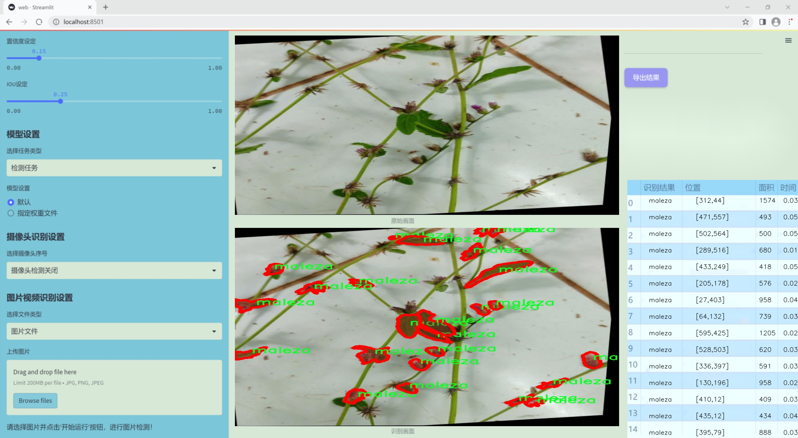
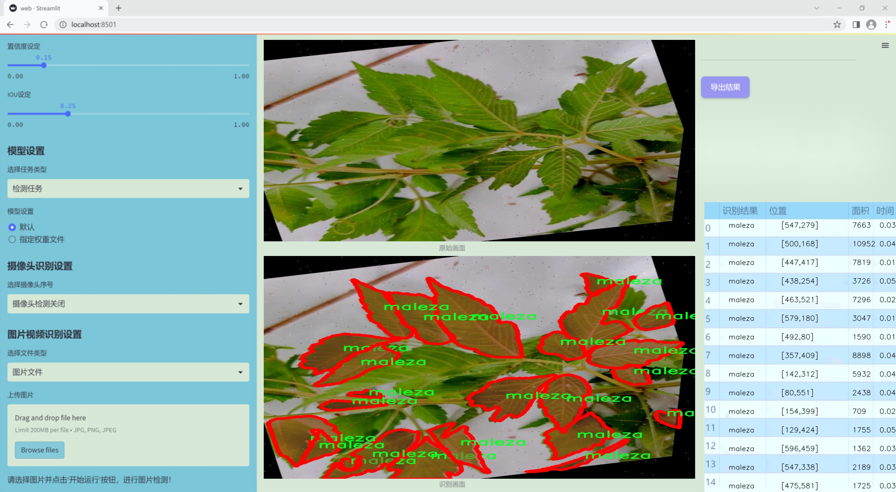
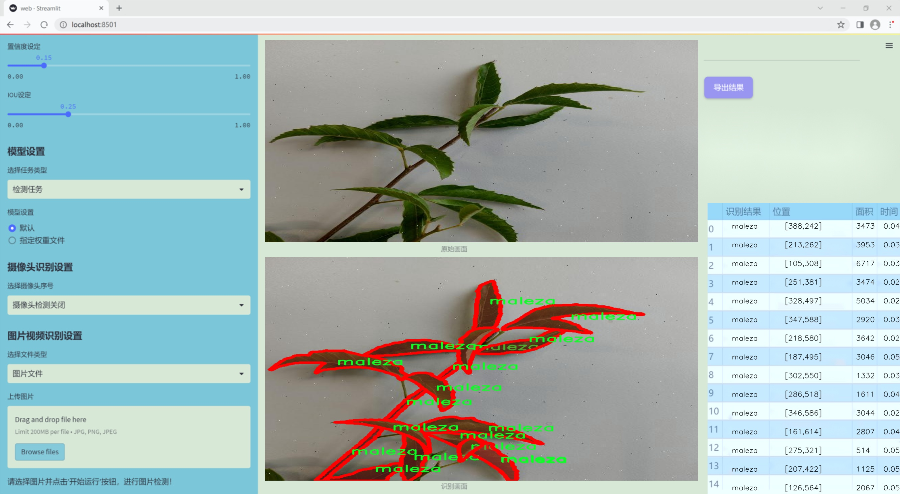
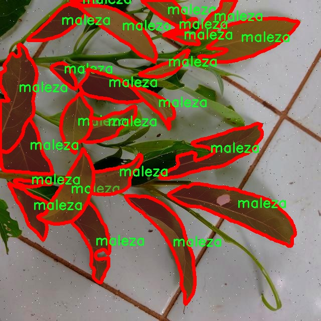
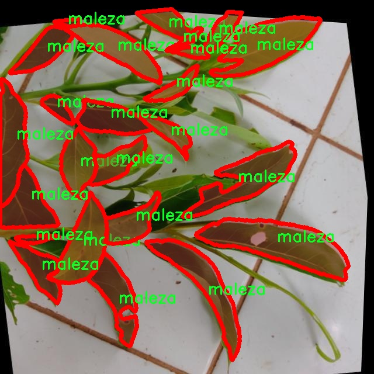
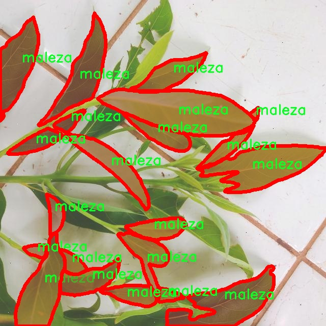
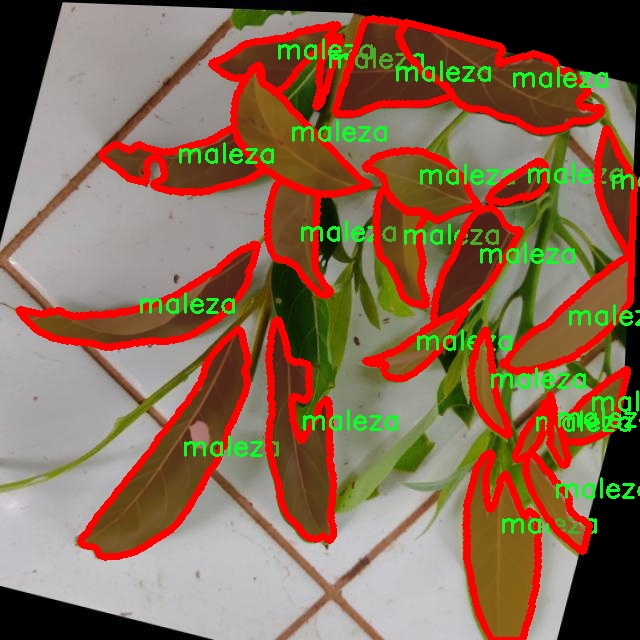
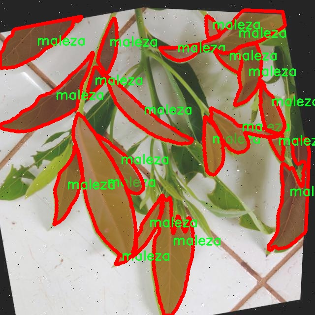

### 1.背景意义

研究背景与意义

随着全球农业生产的不断发展，茶叶作为一种重要的经济作物，其种植和管理面临着越来越多的挑战。其中，杂草的生长不仅影响茶叶的产量和品质，还增加了农药使用的频率，进而对环境造成负面影响。因此，开发一种高效的杂草与茶叶识别系统，能够在早期阶段识别并处理杂草，对于提高茶叶的生产效率和可持续发展具有重要意义。

近年来，深度学习技术在计算机视觉领域取得了显著进展，尤其是目标检测和实例分割任务。YOLO（You Only Look Once）系列模型因其高效的实时检测能力而受到广泛关注。YOLOv11作为该系列的最新版本，具备更强的特征提取能力和更快的推理速度，适合于复杂的农业场景中进行实时监测。通过对YOLOv11进行改进，结合特定的农业数据集，可以实现对杂草和茶叶的高精度识别，从而为农民提供有效的决策支持。

本研究将基于一个包含1500张图像的杂草与茶叶数据集，进行模型训练和优化。该数据集包括两类目标：杂草（maleza）和茶叶（te），为模型的训练提供了丰富的样本。在数据预处理和增强方面，采用了多种技术，如随机亮度和曝光调整，以及盐和胡椒噪声的引入，以提高模型的鲁棒性和泛化能力。这些措施将有助于提升模型在实际应用中的表现，确保其在不同环境和光照条件下的有效性。

综上所述，基于改进YOLOv11的杂草与茶叶识别系统的研究，不仅为农业智能化提供了新的技术手段，也为实现精准农业、提高茶叶生产效率和可持续发展目标奠定了基础。通过该系统的实施，能够有效减少人工干预，提高杂草管理的效率，进而推动茶叶产业的现代化进程。

### 2.视频效果

[2.1 视频效果](https://www.bilibili.com/video/BV1XYkEYHEwr/)

### 3.图片效果







##### [项目涉及的源码数据来源链接](https://kdocs.cn/l/cszuIiCKVNis)**

注意：本项目提供训练的数据集和训练教程,由于版本持续更新,暂不提供权重文件（best.pt）,请按照6.训练教程进行训练后实现上图演示的效果。

### 4.数据集信息

##### 4.1 本项目数据集类别数＆类别名

nc: 2
names: ['maleza', 'te']


该项目为【图像分割】数据集，请在【训练教程和Web端加载模型教程（第三步）】这一步的时候按照【图像分割】部分的教程来训练

##### 4.2 本项目数据集信息介绍

本项目数据集信息介绍

本项目旨在开发一种改进的YOLOv11模型，以实现对杂草与茶叶的高效识别。为此，我们构建了一个专门的数据集，名为“malezas_te”，该数据集专注于两种主要类别：杂草（maleza）和茶叶（te）。在农业生产中，尤其是在茶叶种植领域，杂草的存在不仅影响了茶叶的生长，还可能导致产量和品质的下降。因此，准确识别和分类这些植物，对于提高茶叶的产量和品质具有重要意义。

该数据集包含了丰富的图像样本，涵盖了不同生长阶段、不同光照条件以及不同环境背景下的杂草和茶叶。这些样本经过精心挑选和标注，确保每一张图像都能为模型的训练提供有效的信息。数据集中杂草和茶叶的类别数量为2，分别为“maleza”和“te”。通过多样化的图像来源和条件，我们力求让模型在实际应用中具备更强的适应性和准确性。

在数据集的构建过程中，我们特别关注了样本的多样性和代表性，以确保模型能够在各种环境下进行有效的识别。通过对不同种类杂草的收集与分类，我们不仅提升了模型的识别能力，也为后续的农业管理提供了数据支持。此外，数据集的设计还考虑到了模型训练的效率，确保在保证识别准确率的同时，减少训练时间。

总之，本项目的数据集“malezas_te”是一个专注于杂草与茶叶识别的高质量数据集，旨在为改进YOLOv11模型提供坚实的基础，助力于实现更智能的农业管理和资源优化配置。











### 5.全套项目环境部署视频教程（零基础手把手教学）

[5.1 所需软件PyCharm和Anaconda安装教程（第一步）](https://www.bilibili.com/video/BV1BoC1YCEKi/?spm_id_from=333.999.0.0&vd_source=bc9aec86d164b67a7004b996143742dc)


[5.2 安装Python虚拟环境创建和依赖库安装视频教程（第二步）](https://www.bilibili.com/video/BV1ZoC1YCEBw?spm_id_from=333.788.videopod.sections&vd_source=bc9aec86d164b67a7004b996143742dc)

### 6.改进YOLOv11训练教程和Web_UI前端加载模型教程（零基础手把手教学）

[6.1 改进YOLOv11训练教程和Web_UI前端加载模型教程（第三步）](https://www.bilibili.com/video/BV1BoC1YCEhR?spm_id_from=333.788.videopod.sections&vd_source=bc9aec86d164b67a7004b996143742dc)


按照上面的训练视频教程链接加载项目提供的数据集，运行train.py即可开始训练



     Epoch   gpu_mem       box       obj       cls    labels  img_size
     1/200     20.8G   0.01576   0.01955  0.007536        22      1280: 100%|██████████| 849/849 [14:42<00:00,  1.04s/it]
               Class     Images     Labels          P          R     mAP@.5 mAP@.5:.95: 100%|██████████| 213/213 [01:14<00:00,  2.87it/s]
                 all       3395      17314      0.994      0.957      0.0957      0.0843

     Epoch   gpu_mem       box       obj       cls    labels  img_size
     2/200     20.8G   0.01578   0.01923  0.007006        22      1280: 100%|██████████| 849/849 [14:44<00:00,  1.04s/it]
               Class     Images     Labels          P          R     mAP@.5 mAP@.5:.95: 100%|██████████| 213/213 [01:12<00:00,  2.95it/s]
                 all       3395      17314      0.996      0.956      0.0957      0.0845

     Epoch   gpu_mem       box       obj       cls    labels  img_size
     3/200     20.8G   0.01561    0.0191  0.006895        27      1280: 100%|██████████| 849/849 [10:56<00:00,  1.29it/s]
               Class     Images     Labels          P          R     mAP@.5 mAP@.5:.95: 100%|███████   | 187/213 [00:52<00:00,  4.04it/s]
                 all       3395      17314      0.996      0.957      0.0957      0.0845


###### [项目数据集下载链接](https://kdocs.cn/l/cszuIiCKVNis)

### 7.原始YOLOv11算法讲解


###### YOLOv11改进方向

与YOLOv 10相比，YOLOv 11有了巨大的改进，包括但不限于：

  * 增强的模型结构：模型具有改进的模型结构，以获取图像处理并形成预测
  * GPU优化：这是现代ML模型的反映，GPU训练ML模型在速度和准确性上都更好。
  * 速度：YOLOv 11模型现在经过增强和GPU优化以用于训练。通过优化，这些模型比它们的前版本快得多。在速度上达到了25%的延迟减少！
  * 更少的参数：更少的参数允许更快的模型，但v11的准确性不受影响
  * 更具适应性：更多支持的任务YOLOv 11支持多种类型的任务、多种类型的对象和多种类型的图像。

###### YOLOv11功能介绍

Glenn Jocher和他的团队制作了一个令人敬畏的YOLOv 11迭代，并且在图像人工智能的各个方面都提供了YOLO。YOLOv 11有多种型号，包括：

  * 对象检测-在训练时检测图像中的对象
  * 图像分割-超越对象检测，分割出图像中的对象
  * 姿态检测-当用点和线训练时绘制一个人的姿势
  * 定向检测（OBB）：类似于对象检测，但包围盒可以旋转
  * 图像分类-在训练时对图像进行分类

使用Ultralytics Library，这些模型还可以进行优化，以：

  * 跟踪-可以跟踪对象的路径
  * 易于导出-库可以以不同的格式和目的导出
  * 多场景-您可以针对不同的对象和图像训练模型

此外，Ultralytics还推出了YOLOv 11的企业模型，该模型将于10月31日发布。这将与开源的YOLOv
11模型并行，但将拥有更大的专有Ultralytics数据集。YOLOv 11是“建立在过去的成功”的其他版本的之上。

###### YOLOv11模型介绍

YOLOv 11附带了边界框模型（无后缀），实例分割（-seg），姿态估计（-pose），定向边界框（-obb）和分类（-cls）。

这些也有不同的尺寸：纳米（n），小（s），中（m），大（l），超大（x）。


YOLOv11模型

###### YOLOv11与前版本对比

与YOLOv10和YOLOv8相比，YOLOv11在Ultralytics的任何帖子中都没有直接提到。所以我会收集所有的数据来比较它们。感谢Ultralytics：

**检测：**


YOLOv11检测统计


YOLOv10检测统计

其中，Nano的mAPval在v11上为39.5，v10上为38.5；Small为47.0 vs 46.3，Medium为51.5 vs
51.1，Large为53.4 vs 53.2，Extra Large为54.7vs
54.4。现在，这可能看起来像是一种增量增加，但小小数的增加可能会对ML模型产生很大影响。总体而言，YOLOv11以0.3
mAPval的优势追平或击败YOLOv10。

现在，我们必须看看速度。在延迟方面，Nano在v11上为1.55 , v10上为1.84，Small为2.46 v2.49，Medium为4.70
v4.74，Large为6.16 v7.28，Extra Large为11.31
v10.70。延迟越低越好。YOLOv11提供了一个非常低的延迟相比，除了特大做得相当差的前身。

总的来说，Nano模型是令人振奋的，速度更快，性能相当。Extra Large在性能上有很好的提升，但它的延迟非常糟糕。

**分割：**


YOLOV11 分割统计


YOLOV9 分割统计


YOLOV8 分割数据

总体而言，YOLOv 11上的分割模型在大型和超大型模型方面比上一代YOLOv 8和YOLOv 9做得更好。

YOLOv 9 Segmentation没有提供任何关于延迟的统计数据。比较YOLOv 11延迟和YOLOv 8延迟，发现YOLOv 11比YOLOv
8快得多。YOLOv 11将大量GPU集成到他们的模型中，因此期望他们的模型甚至比CPU测试的基准更快！

姿态估计：


YOLOV11姿态估计统计


YOLOV8姿态估计统计

YOLOv 11的mAP 50 -95统计量也逐渐优于先前的YOLOv 8（除大型外）。然而，在速度方面，YOLOv
11姿势可以最大限度地减少延迟。其中一些延迟指标是版本的1/4！通过对这些模型进行GPU训练优化，我可以看到指标比显示的要好得多。

**定向边界框：**


YOLOv11 OBB统计


YOLOv8 OBB统计

OBB统计数据在mAP
50上并不是很好，只有非常小的改进，在某种程度上小于检测中的微小改进。然而，从v8到v11的速度减半，这表明YOLOv11在速度上做了很多努力。

**最后，分类：**


YOLOv 11 CLS统计


YOLOv8 CLS统计

从v8到v11，准确性也有了微小的提高。然而，速度大幅上升，CPU速度更快的型号。


### 8.200+种全套改进YOLOV11创新点原理讲解

#### 8.1 200+种全套改进YOLOV11创新点原理讲解大全

由于篇幅限制，每个创新点的具体原理讲解就不全部展开，具体见下列网址中的改进模块对应项目的技术原理博客网址【Blog】（创新点均为模块化搭建，原理适配YOLOv5~YOLOv11等各种版本）

[改进模块技术原理博客【Blog】网址链接](https://gitee.com/qunmasj/good)


#### 8.2 精选部分改进YOLOV11创新点原理讲解

###### 这里节选部分改进创新点展开原理讲解(完整的改进原理见上图和[改进模块技术原理博客链接](https://gitee.com/qunmasj/good)【如果此小节的图加载失败可以通过CSDN或者Github搜索该博客的标题访问原始博客，原始博客图片显示正常】

### 动态蛇形卷积Dynamic Snake Convolution

参考论文： 2307.08388.pdf (arxiv.org)

血管、道路等拓扑管状结构的精确分割在各个领域都至关重要，确保下游任务的准确性和效率。 然而，许多因素使任务变得复杂，包括薄的局部结构和可变的全局形态。在这项工作中，我们注意到管状结构的特殊性，并利用这些知识来指导我们的 DSCNet 在三个阶段同时增强感知：特征提取、特征融合、 和损失约束。 首先，我们提出了一种动态蛇卷积，通过自适应地关注细长和曲折的局部结构来准确捕获管状结构的特征。 随后，我们提出了一种多视图特征融合策略，以补充特征融合过程中多角度对特征的关注，确保保留来自不同全局形态的重要信息。 最后，提出了一种基于持久同源性的连续性约束损失函数，以更好地约束分割的拓扑连续性。 2D 和 3D 数据集上的实验表明，与多种方法相比，我们的 DSCNet 在管状结构分割任务上提供了更好的准确性和连续性。 我们的代码是公开的。 
主要的挑战源于细长微弱的局部结构特征与复杂多变的全局形态特征。本文关注到管状结构细长连续的特点，并利用这一信息在神经网络以下三个阶段同时增强感知：特征提取、特征融合和损失约束。分别设计了动态蛇形卷积（Dynamic Snake Convolution），多视角特征融合策略与连续性拓扑约束损失。 

我们希望卷积核一方面能够自由地贴合结构学习特征，另一方面能够在约束条件下不偏离目标结构太远。在观察管状结构的细长连续的特征后，脑海里想到了一个动物——蛇。我们希望卷积核能够像蛇一样动态地扭动，来贴合目标的结构。

我们希望卷积核一方面能够自由地贴合结构学习特征，另一方面能够在约束条件下不偏离目标结构太远。在观察管状结构的细长连续的特征后，脑海里想到了一个动物——蛇。我们希望卷积核能够像蛇一样动态地扭动，来贴合目标的结构。


### DCNV2融入YOLOv11
DCN和DCNv2（可变性卷积）
网上关于两篇文章的详细描述已经很多了，我这里具体的细节就不多讲了，只说一下其中实现起来比较困惑的点。（黑体字会讲解）

DCNv1解决的问题就是我们常规的图像增强，仿射变换（线性变换加平移）不能解决的多种形式目标变换的几何变换的问题。如下图所示。

可变性卷积的思想很简单，就是讲原来固定形状的卷积核变成可变的。如下图所示：


首先来看普通卷积，以3x3卷积为例对于每个输出y(p0)，都要从x上采样9个位置，这9个位置都在中心位置x(p0)向四周扩散得到的gird形状上，(-1,-1)代表x(p0)的左上角，(1,1)代表x(p0)的右下角，其他类似。

用公式表示如下：


可变性卷积Deformable Conv操作并没有改变卷积的计算操作，而是在卷积操作的作用区域上，加入了一个可学习的参数∆pn。同样对于每个输出y(p0)，都要从x上采样9个位置，这9个位置是中心位置x(p0)向四周扩散得到的，但是多了 ∆pn，允许采样点扩散成非gird形状。


偏移量是通过对原始特征层进行卷积得到的。比如输入特征层是w×h×c，先对输入的特征层进行卷积操作，得到w×h×2c的offset field。这里的w和h和原始特征层的w和h是一致的，offset field里面的值是输入特征层对应位置的偏移量，偏移量有x和y两个方向，所以offset field的channel数是2c。offset field里的偏移量是卷积得到的，可能是浮点数，所以接下来需要通过双向性插值计算偏移位置的特征值。在偏移量的学习中，梯度是通过双线性插值来进行反向传播的。
看到这里是不是还是有点迷茫呢？那到底程序上面怎么实现呢？


事实上由上面的公式我们可以看得出来∆pn这个偏移量是加在原像素点上的，但是我们怎么样从代码上对原像素点加这个量呢？其实很简单，就是用一个普通的卷积核去跟输入图片（一般是输入的feature_map）卷积就可以了卷积核的数量是2N也就是23*3==18（前9个通道是x方向的偏移量，后9个是y方向的偏移量），然后把这个卷积的结果与正常卷积的结果进行相加就可以了。
然后又有了第二个问题，怎么样反向传播呢？为什么会有这个问题呢？因为求出来的偏移量+正常卷积输出的结果往往是一个浮点数，浮点数是无法对应到原图的像素点的，所以自然就想到了双线性差值的方法求出浮点数对应的浮点像素点。


#### DCN v2
对于positive的样本来说，采样的特征应该focus在RoI内，如果特征中包含了过多超出RoI的内容，那么结果会受到影响和干扰。而negative样本则恰恰相反，引入一些超出RoI的特征有助于帮助网络判别这个区域是背景区域。

DCNv1引入了可变形卷积，能更好的适应目标的几何变换。但是v1可视化结果显示其感受野对应位置超出了目标范围，导致特征不受图像内容影响（理想情况是所有的对应位置分布在目标范围以内）。

为了解决该问题：提出v2, 主要有

1、扩展可变形卷积，增强建模能力
2、提出了特征模拟方案指导网络培训：feature mimicking scheme

上面这段话是什么意思呢，通俗来讲就是，我们的可变性卷积的区域大于目标所在区域，所以这时候就会对非目标区域进行错误识别。

所以自然能想到的解决方案就是加入权重项进行惩罚。（至于这个实现起来就比较简单了，直接初始化一个权重然后乘(input+offsets)就可以了）


可调节的RoIpooling也是类似的，公式如下：


### 9.系统功能展示

图9.1.系统支持检测结果表格显示

  图9.2.系统支持置信度和IOU阈值手动调节

  图9.3.系统支持自定义加载权重文件best.pt(需要你通过步骤5中训练获得)

  图9.4.系统支持摄像头实时识别

  图9.5.系统支持图片识别

  图9.6.系统支持视频识别

  图9.7.系统支持识别结果文件自动保存

  图9.8.系统支持Excel导出检测结果数据


### 10. YOLOv11核心改进源码讲解

#### 10.1 metaformer.py

以下是经过简化和注释的核心代码部分，主要保留了与MetaFormer相关的模块及其重要功能。

```python
import torch
import torch.nn as nn
import torch.nn.functional as F

class Scale(nn.Module):
    """
    通过元素乘法缩放向量。
    """
    def __init__(self, dim, init_value=1.0, trainable=True):
        super().__init__()
        # 初始化可训练的缩放参数
        self.scale = nn.Parameter(init_value * torch.ones(dim), requires_grad=trainable)

    def forward(self, x):
        # 将输入乘以缩放参数
        return x * self.scale

class MF_Attention(nn.Module):
    """
    自注意力机制的实现，基于Transformer模型。
    """
    def __init__(self, dim, head_dim=32, num_heads=None, qkv_bias=False,
                 attn_drop=0., proj_drop=0., proj_bias=False):
        super().__init__()
        self.head_dim = head_dim
        self.scale = head_dim ** -0.5  # 缩放因子

        # 计算头的数量
        self.num_heads = num_heads if num_heads else dim // head_dim
        if self.num_heads == 0:
            self.num_heads = 1
        
        self.attention_dim = self.num_heads * self.head_dim

        # 定义QKV线性变换
        self.qkv = nn.Linear(dim, self.attention_dim * 3, bias=qkv_bias)
        self.attn_drop = nn.Dropout(attn_drop)  # 注意力丢弃层
        self.proj = nn.Linear(self.attention_dim, dim, bias=proj_bias)  # 输出线性变换
        self.proj_drop = nn.Dropout(proj_drop)  # 输出丢弃层

    def forward(self, x):
        B, H, W, C = x.shape  # B: 批量大小, H: 高度, W: 宽度, C: 通道数
        N = H * W  # 总的token数量
        # 计算QKV
        qkv = self.qkv(x).reshape(B, N, 3, self.num_heads, self.head_dim).permute(2, 0, 3, 1, 4)
        q, k, v = qkv.unbind(0)  # 分离Q, K, V

        # 计算注意力权重
        attn = (q @ k.transpose(-2, -1)) * self.scale
        attn = attn.softmax(dim=-1)  # 归一化
        attn = self.attn_drop(attn)  # 应用丢弃

        # 计算输出
        x = (attn @ v).transpose(1, 2).reshape(B, H, W, self.attention_dim)
        x = self.proj(x)  # 投影到原始维度
        x = self.proj_drop(x)  # 应用丢弃
        return x

class Mlp(nn.Module):
    """
    MLP模块，用于MetaFormer模型。
    """
    def __init__(self, dim, mlp_ratio=4, out_features=None, act_layer=nn.GELU, drop=0., bias=False):
        super().__init__()
        in_features = dim
        out_features = out_features or in_features
        hidden_features = int(mlp_ratio * in_features)

        # 定义两层线性变换和激活函数
        self.fc1 = nn.Linear(in_features, hidden_features, bias=bias)
        self.act = act_layer()  # 激活函数
        self.drop1 = nn.Dropout(drop)  # 第一个丢弃层
        self.fc2 = nn.Linear(hidden_features, out_features, bias=bias)
        self.drop2 = nn.Dropout(drop)  # 第二个丢弃层

    def forward(self, x):
        x = self.fc1(x)  # 第一层线性变换
        x = self.act(x)  # 激活
        x = self.drop1(x)  # 丢弃
        x = self.fc2(x)  # 第二层线性变换
        x = self.drop2(x)  # 丢弃
        return x

class MetaFormerBlock(nn.Module):
    """
    MetaFormer模块的实现。
    """
    def __init__(self, dim, token_mixer=nn.Identity, mlp=Mlp,
                 norm_layer=nn.LayerNorm, drop=0., drop_path=0.):
        super().__init__()

        self.norm1 = norm_layer(dim)  # 第一层归一化
        self.token_mixer = token_mixer(dim=dim, drop=drop)  # token混合层
        self.drop_path1 = nn.Dropout(drop_path) if drop_path > 0. else nn.Identity()  # 丢弃路径
        self.layer_scale1 = Scale(dim=dim)  # 第一层缩放

        self.norm2 = norm_layer(dim)  # 第二层归一化
        self.mlp = mlp(dim=dim, drop=drop)  # MLP层
        self.drop_path2 = nn.Dropout(drop_path) if drop_path > 0. else nn.Identity()  # 丢弃路径
        self.layer_scale2 = Scale(dim=dim)  # 第二层缩放

    def forward(self, x):
        x = self.norm1(x)  # 归一化
        x = self.token_mixer(x)  # token混合
        x = self.drop_path1(x)  # 丢弃路径
        x = self.layer_scale1(x)  # 缩放

        x = self.norm2(x)  # 归一化
        x = self.mlp(x)  # MLP
        x = self.drop_path2(x)  # 丢弃路径
        x = self.layer_scale2(x)  # 缩放
        return x
```

### 代码说明
1. **Scale**: 这个模块用于实现可训练的缩放因子，通常用于调整特征的尺度。
2. **MF_Attention**: 实现了自注意力机制，包含QKV的计算、注意力权重的归一化以及最终的输出映射。
3. **Mlp**: 实现了一个简单的多层感知机（MLP），包括两层线性变换和激活函数。
4. **MetaFormerBlock**: 这是MetaFormer的基本构建块，结合了归一化、token混合、MLP和缩放机制。

以上代码为MetaFormer模型的核心部分，展示了其基本结构和功能。

这个文件 `metaformer.py` 实现了一系列与 MetaFormer 相关的深度学习模块，主要用于构建基于 Transformer 的模型。文件中包含了多个类，每个类都定义了特定的功能模块，下面是对这些模块的逐一说明。

首先，`Scale` 类用于对输入张量进行元素级别的缩放。它通过一个可训练的参数 `scale` 来实现这一点，允许在训练过程中自动调整缩放因子。

接下来，`SquaredReLU` 和 `StarReLU` 类实现了两种不同的激活函数。`SquaredReLU` 是对标准 ReLU 激活函数的平方操作，而 `StarReLU` 则结合了缩放和偏置的 ReLU 激活，形式为 \( s \cdot \text{ReLU}(x)^2 + b \)，其中 \( s \) 和 \( b \) 是可训练的参数。

`MF_Attention` 类实现了基本的自注意力机制，类似于 Transformer 中的自注意力。它通过线性变换生成查询、键和值，并计算注意力权重。该类还包括 dropout 操作，以防止过拟合。

`RandomMixing` 类则实现了一种随机混合机制，通过一个随机生成的矩阵对输入进行混合。该矩阵在初始化时使用 softmax 进行归一化，以确保其每一行的和为 1。

`LayerNormGeneral` 类是一个通用的层归一化实现，允许用户指定归一化的维度和是否使用缩放和偏置。它的设计使得可以适应不同的输入形状和归一化需求。

`LayerNormWithoutBias` 类是一个更高效的层归一化实现，直接利用 PyTorch 的优化函数 `F.layer_norm`，省略了偏置项，从而提高了计算效率。

`SepConv` 类实现了分离卷积，这是一种在 MobileNetV2 中使用的卷积方式。它首先通过一个线性层进行逐点卷积，然后进行深度卷积，最后再通过另一个线性层输出结果。

`Pooling` 类实现了一种特定的池化操作，主要用于 PoolFormer 模型。它通过平均池化来降低特征图的维度，并返回池化后的结果与原始输入的差值。

`Mlp` 类实现了一个多层感知机（MLP），通常用于 MetaFormer 模型中。它由两个线性层和一个激活函数组成，并在每个线性层后面添加了 dropout 操作。

`ConvolutionalGLU` 类实现了一种卷积门控线性单元（GLU），通过卷积操作和门控机制来增强特征表达能力。它包括一个逐点卷积、一个深度卷积和另一个逐点卷积。

`MetaFormerBlock` 和 `MetaFormerCGLUBlock` 类分别实现了 MetaFormer 的基本模块。这些模块结合了归一化、注意力机制和 MLP 结构，通过残差连接和可选的层缩放来增强模型的表现。`MetaFormerCGLUBlock` 特别使用了卷积门控线性单元作为 MLP。

整体来看，这个文件定义了一系列构建深度学习模型所需的基础组件，特别是针对 MetaFormer 结构的设计，提供了灵活性和可扩展性，适用于各种任务和数据集。

#### 10.2 utils.py

以下是代码中最核心的部分，并附上详细的中文注释：

```python
import torch
import torch.nn.functional as F

def multi_scale_deformable_attn_pytorch(
    value: torch.Tensor,
    value_spatial_shapes: torch.Tensor,
    sampling_locations: torch.Tensor,
    attention_weights: torch.Tensor,
) -> torch.Tensor:
    """
    多尺度可变形注意力机制。

    参数:
    - value: 输入特征图，形状为 (batch_size, channels, num_heads, embed_dims)
    - value_spatial_shapes: 特征图的空间形状，形状为 (num_levels, 2)
    - sampling_locations: 采样位置，形状为 (batch_size, num_queries, num_heads, num_levels, num_points, 2)
    - attention_weights: 注意力权重，形状为 (batch_size, num_heads, num_queries, num_levels, num_points)

    返回:
    - output: 经过多尺度可变形注意力后的输出，形状为 (batch_size, num_queries, num_heads * embed_dims)
    """
    bs, _, num_heads, embed_dims = value.shape  # 获取输入特征图的形状
    _, num_queries, _, num_levels, num_points, _ = sampling_locations.shape  # 获取采样位置的形状

    # 将输入特征图根据空间形状拆分为多个特征图
    value_list = value.split([H_ * W_ for H_, W_ in value_spatial_shapes], dim=1)
    
    # 将采样位置转换到[-1, 1]的范围
    sampling_grids = 2 * sampling_locations - 1
    sampling_value_list = []  # 用于存储每个层级的采样值

    for level, (H_, W_) in enumerate(value_spatial_shapes):
        # 对每个层级的特征图进行处理
        value_l_ = value_list[level].flatten(2).transpose(1, 2).reshape(bs * num_heads, embed_dims, H_, W_)
        
        # 处理采样位置
        sampling_grid_l_ = sampling_grids[:, :, :, level].transpose(1, 2).flatten(0, 1)
        
        # 使用grid_sample进行双线性插值采样
        sampling_value_l_ = F.grid_sample(
            value_l_, sampling_grid_l_, mode="bilinear", padding_mode="zeros", align_corners=False
        )
        sampling_value_list.append(sampling_value_l_)  # 保存采样结果

    # 转换注意力权重的形状
    attention_weights = attention_weights.transpose(1, 2).reshape(
        bs * num_heads, 1, num_queries, num_levels * num_points
    )
    
    # 计算最终输出
    output = (
        (torch.stack(sampling_value_list, dim=-2).flatten(-2) * attention_weights)
        .sum(-1)
        .view(bs, num_heads * embed_dims, num_queries)
    )
    
    return output.transpose(1, 2).contiguous()  # 返回最终输出，调整维度顺序
```

### 代码说明：
1. **输入参数**：
   - `value`：输入特征图，包含多个头部和嵌入维度。
   - `value_spatial_shapes`：特征图的空间形状，用于拆分特征图。
   - `sampling_locations`：采样位置，指示在特征图上采样的具体位置。
   - `attention_weights`：注意力权重，用于加权不同层级的采样值。

2. **主要步骤**：
   - 将输入特征图拆分为多个层级的特征图。
   - 将采样位置转换到[-1, 1]的范围，以适应`grid_sample`函数。
   - 对每个层级的特征图进行双线性插值采样，得到对应的采样值。
   - 根据注意力权重加权不同层级的采样值，并计算最终输出。

3. **输出**：
   - 返回经过多尺度可变形注意力机制处理后的输出，形状为(batch_size, num_queries, num_heads * embed_dims)。

这个程序文件 `utils.py` 是一个用于实现深度学习模型的工具模块，特别是与 YOLO（You Only Look Once）相关的功能。文件中包含了一些常用的函数和方法，主要用于模型的初始化和多尺度可变形注意力机制的实现。

首先，文件导入了一些必要的库，包括 `copy`、`math`、`numpy` 和 `torch`，后者是 PyTorch 的核心库，提供了张量操作和神经网络构建的功能。

文件中定义了几个函数。`_get_clones(module, n)` 函数用于创建一个给定模块的深拷贝列表，返回一个 `nn.ModuleList`，这在构建多层网络时非常有用。

`bias_init_with_prob(prior_prob=0.01)` 函数用于根据给定的概率值初始化卷积或全连接层的偏置。它通过计算负对数几率来设置偏置值，以确保在训练初期，模型的输出符合预期的概率分布。

`linear_init(module)` 函数用于初始化线性模块的权重和偏置。它使用均匀分布在特定范围内随机初始化权重和偏置，以提高模型的收敛速度。

`inverse_sigmoid(x, eps=1e-5)` 函数计算张量的反 sigmoid 函数。它首先将输入限制在 [0, 1] 的范围内，然后计算反 sigmoid 值，常用于某些模型的输出处理。

`multi_scale_deformable_attn_pytorch` 函数实现了多尺度可变形注意力机制。该函数接收多个参数，包括值张量、空间形状、采样位置和注意力权重。它首先对输入的值张量进行分割，然后计算采样网格，并通过双线性插值对值进行采样。接着，它将采样值与注意力权重相乘并求和，最终输出一个调整后的张量。

整体来看，这个模块提供了一些基础的工具函数，旨在为深度学习模型的构建和训练提供支持，尤其是在处理复杂的注意力机制时。

#### 10.3 FreqFusion.py

以下是经过简化和注释的核心代码部分，主要保留了 `FreqFusion` 类及其关键方法，并对其进行了详细的中文注释：

```python
import torch
import torch.nn as nn
import torch.nn.functional as F

class FreqFusion(nn.Module):
    def __init__(self, channels, scale_factor=1, lowpass_kernel=5, highpass_kernel=3, **kwargs):
        super().__init__()
        hr_channels, lr_channels = channels
        self.scale_factor = scale_factor
        self.lowpass_kernel = lowpass_kernel
        self.highpass_kernel = highpass_kernel
        
        # 压缩高分辨率和低分辨率特征通道
        self.compressed_channels = (hr_channels + lr_channels) // 8
        self.hr_channel_compressor = nn.Conv2d(hr_channels, self.compressed_channels, 1)
        self.lr_channel_compressor = nn.Conv2d(lr_channels, self.compressed_channels, 1)

        # 内容编码器，用于生成低通滤波器
        self.content_encoder = nn.Conv2d(
            self.compressed_channels,
            lowpass_kernel ** 2,
            kernel_size=3,
            padding=1
        )

        # 初始化权重
        self.init_weights()

    def init_weights(self):
        """初始化网络权重"""
        for m in self.modules():
            if isinstance(m, nn.Conv2d):
                nn.init.xavier_uniform_(m.weight)  # 使用Xavier初始化
                if m.bias is not None:
                    nn.init.constant_(m.bias, 0)  # 偏置初始化为0

    def kernel_normalizer(self, mask, kernel):
        """对生成的mask进行归一化处理"""
        n, mask_c, h, w = mask.size()
        mask_channel = int(mask_c / float(kernel**2))
        mask = mask.view(n, mask_channel, -1, h, w)
        mask = F.softmax(mask, dim=2)  # 对mask进行softmax归一化
        mask = mask.view(n, mask_channel, kernel, kernel, h, w)
        mask = mask.permute(0, 1, 4, 5, 2, 3).view(n, -1, kernel, kernel)
        mask /= mask.sum(dim=(-1, -2), keepdims=True)  # 归一化
        return mask

    def forward(self, x):
        """前向传播"""
        hr_feat, lr_feat = x  # 输入的高分辨率和低分辨率特征
        compressed_hr_feat = self.hr_channel_compressor(hr_feat)  # 压缩高分辨率特征
        compressed_lr_feat = self.lr_channel_compressor(lr_feat)  # 压缩低分辨率特征

        # 生成低通滤波器的mask
        mask_lr = self.content_encoder(compressed_lr_feat)
        mask_lr = self.kernel_normalizer(mask_lr, self.lowpass_kernel)  # 归一化mask

        # 进行低通滤波
        lr_feat = F.conv2d(lr_feat, mask_lr, padding=self.lowpass_kernel // 2)  # 使用mask进行卷积操作

        # 返回融合后的特征
        return hr_feat + lr_feat  # 将高分辨率特征与处理后的低分辨率特征相加
```

### 代码说明：
1. **类 `FreqFusion`**: 这是一个用于特征融合的神经网络模块，主要用于图像预测任务。
2. **初始化方法 `__init__`**: 初始化网络的各个层，包括通道压缩层和内容编码器。
3. **权重初始化方法 `init_weights`**: 使用 Xavier 初始化方法对卷积层的权重进行初始化，偏置初始化为0。
4. **`kernel_normalizer` 方法**: 对生成的mask进行归一化处理，以确保其在卷积操作中能够有效使用。
5. **前向传播方法 `forward`**: 接收高分辨率和低分辨率特征，进行特征压缩和融合，返回融合后的特征。

以上代码为核心部分，简化了其他不必要的功能和细节，以便于理解和使用。

这个程序文件 `FreqFusion.py` 实现了一种名为“频率感知特征融合”的方法，主要用于密集图像预测任务。它使用了深度学习框架 PyTorch，并包含了一些图像处理的操作和模块。

首先，文件中导入了必要的库，包括 PyTorch 及其神经网络模块，以及一些图像处理的函数。它还尝试从 `mmcv` 库中导入一些操作，如果导入失败则会忽略这些操作。接着，定义了一些初始化函数，如 `normal_init` 和 `constant_init`，用于初始化神经网络中的权重和偏置。

`resize` 函数用于调整输入张量的大小，使用了 PyTorch 的插值功能，并在某些情况下发出警告。`hamming2D` 函数则生成一个二维的 Hamming 窗，通常用于信号处理中的窗口函数。

接下来，定义了 `FreqFusion` 类，它是整个模型的核心。构造函数中接收多个参数，主要包括通道数、缩放因子、低通和高通卷积核的大小等。类中定义了多个卷积层，用于特征压缩和内容编码。它还根据需要初始化 Hamming 窗，并调用 `init_weights` 方法对网络权重进行初始化。

`init_weights` 方法遍历所有模块，并对卷积层进行 Xavier 初始化和正态初始化。`kernel_normalizer` 方法用于对卷积核进行归一化处理。

`forward` 方法是模型的前向传播函数，它接收高分辨率和低分辨率的特征图，并根据设置决定是否使用检查点来节省内存。 `_forward` 方法则实现了具体的特征融合逻辑，包括特征的压缩、卷积、上采样等操作。

在 `_forward` 方法中，首先对高分辨率和低分辨率特征进行压缩，然后根据是否使用半卷积和特征重采样进行不同的处理。它使用了 CARAFE（Content-Aware ReAssembly of FEatures）操作来进行特征的重构和融合。

最后，定义了 `LocalSimGuidedSampler` 类，它用于生成偏移量以引导特征重采样。这个类中实现了计算相似度的功能，能够根据输入特征计算其与周围像素的相似度，并根据这些相似度生成偏移量。

整体来看，这个程序文件实现了一种复杂的图像特征融合机制，结合了多种卷积操作和特征重采样技术，旨在提高密集图像预测的性能。

#### 10.4 fasternet.py

以下是经过简化和注释的核心代码部分，主要包括模型的定义和前向传播过程。

```python
import torch
import torch.nn as nn
from typing import List
from torch import Tensor

class PartialConv3(nn.Module):
    """部分卷积层，用于在前向传播中处理输入特征图的不同部分。"""

    def __init__(self, dim, n_div, forward):
        super().__init__()
        self.dim_conv3 = dim // n_div  # 计算卷积通道数
        self.dim_untouched = dim - self.dim_conv3  # 计算未处理的通道数
        self.partial_conv3 = nn.Conv2d(self.dim_conv3, self.dim_conv3, 3, 1, 1, bias=False)  # 定义卷积层

        # 根据前向传播类型选择相应的前向方法
        if forward == 'slicing':
            self.forward = self.forward_slicing
        elif forward == 'split_cat':
            self.forward = self.forward_split_cat
        else:
            raise NotImplementedError

    def forward_slicing(self, x: Tensor) -> Tensor:
        """仅用于推理阶段的前向传播方法。"""
        x = x.clone()  # 保持原始输入不变，以便后续的残差连接
        x[:, :self.dim_conv3, :, :] = self.partial_conv3(x[:, :self.dim_conv3, :, :])  # 处理部分通道
        return x

    def forward_split_cat(self, x: Tensor) -> Tensor:
        """用于训练和推理阶段的前向传播方法。"""
        x1, x2 = torch.split(x, [self.dim_conv3, self.dim_untouched], dim=1)  # 分割输入
        x1 = self.partial_conv3(x1)  # 处理分割后的部分
        x = torch.cat((x1, x2), 1)  # 连接处理后的部分和未处理的部分
        return x


class MLPBlock(nn.Module):
    """多层感知机块，包含卷积和激活层。"""

    def __init__(self, dim, n_div, mlp_ratio, drop_path, layer_scale_init_value, act_layer, norm_layer, pconv_fw_type):
        super().__init__()
        self.dim = dim
        self.mlp_ratio = mlp_ratio
        self.drop_path = nn.Identity() if drop_path <= 0 else nn.Dropout(drop_path)  # 处理随机丢弃
        self.n_div = n_div

        mlp_hidden_dim = int(dim * mlp_ratio)  # 计算隐藏层维度

        # 定义多层感知机结构
        mlp_layer: List[nn.Module] = [
            nn.Conv2d(dim, mlp_hidden_dim, 1, bias=False),
            norm_layer(mlp_hidden_dim),
            act_layer(),
            nn.Conv2d(mlp_hidden_dim, dim, 1, bias=False)
        ]
        self.mlp = nn.Sequential(*mlp_layer)  # 将层组合成序列

        # 定义空间混合层
        self.spatial_mixing = PartialConv3(dim, n_div, pconv_fw_type)

    def forward(self, x: Tensor) -> Tensor:
        """前向传播方法。"""
        shortcut = x  # 保存输入以进行残差连接
        x = self.spatial_mixing(x)  # 通过空间混合层处理输入
        x = shortcut + self.drop_path(self.mlp(x))  # 残差连接
        return x


class FasterNet(nn.Module):
    """FasterNet模型的定义。"""

    def __init__(self, in_chans=3, num_classes=1000, embed_dim=96, depths=(1, 2, 8, 2), mlp_ratio=2., n_div=4,
                 patch_size=4, patch_stride=4, patch_norm=True, drop_path_rate=0.1, norm_layer=nn.BatchNorm2d,
                 act_layer=nn.ReLU, pconv_fw_type='split_cat'):
        super().__init__()

        self.patch_embed = nn.Conv2d(in_chans, embed_dim, kernel_size=patch_size, stride=patch_stride, bias=False)  # 定义补丁嵌入层

        # 构建各个阶段的层
        stages_list = []
        for i_stage in range(len(depths)):
            stage = MLPBlock(dim=int(embed_dim * 2 ** i_stage), n_div=n_div, mlp_ratio=mlp_ratio,
                             drop_path=drop_path_rate, layer_scale_init_value=0, norm_layer=norm_layer,
                             act_layer=act_layer, pconv_fw_type=pconv_fw_type)
            stages_list.append(stage)

        self.stages = nn.Sequential(*stages_list)  # 将所有阶段组合成序列

    def forward(self, x: Tensor) -> List[Tensor]:
        """前向传播方法，输出特征图。"""
        x = self.patch_embed(x)  # 通过补丁嵌入层处理输入
        outs = []
        for stage in self.stages:
            x = stage(x)  # 逐层处理输入
            outs.append(x)  # 保存每一层的输出
        return outs  # 返回所有阶段的输出


# 示例：创建FasterNet模型并进行前向传播
if __name__ == '__main__':
    model = FasterNet()  # 创建FasterNet模型实例
    inputs = torch.randn((1, 3, 640, 640))  # 生成随机输入
    outputs = model(inputs)  # 进行前向传播
    for out in outputs:
        print(out.size())  # 打印每一层输出的尺寸
```

### 代码说明：
1. **PartialConv3**：实现了部分卷积的功能，可以根据不同的前向传播策略处理输入特征图。
2. **MLPBlock**：实现了多层感知机的结构，包含卷积、归一化和激活层，并支持残差连接。
3. **FasterNet**：整体模型的定义，包含补丁嵌入层和多个MLPBlock，通过前向传播处理输入并输出特征图。
4. **前向传播**：在`__main__`部分，创建模型实例并进行一次前向传播，输出每一层的特征图尺寸。

这个程序文件 `fasternet.py` 实现了一个名为 FasterNet 的深度学习模型，主要用于图像处理任务。文件中包含了多个类和函数，用于构建和管理模型的各个部分。

首先，程序导入了必要的库，包括 PyTorch、YAML 和一些深度学习相关的模块。接着，定义了一些辅助类，例如 `Partial_conv3`、`MLPBlock`、`BasicStage`、`PatchEmbed` 和 `PatchMerging`，这些类分别实现了模型中的不同功能。

`Partial_conv3` 类实现了部分卷积操作，可以根据不同的前向传播方式（如切片或拼接）处理输入数据。`MLPBlock` 类则实现了多层感知机（MLP）结构，包含了卷积层、归一化层和激活函数，并且支持残差连接。`BasicStage` 类由多个 `MLPBlock` 组成，形成模型的基本构建块。

`PatchEmbed` 类用于将输入图像分割成不重叠的补丁，并进行嵌入。`PatchMerging` 类则用于在模型的不同阶段合并补丁，以减少特征图的尺寸并增加通道数。

`FasterNet` 类是模型的核心，构造函数中定义了模型的各个参数，包括输入通道数、类别数、嵌入维度、各个阶段的深度等。模型通过 `PatchEmbed` 类将输入图像转换为补丁，并通过多个 `BasicStage` 进行处理。每个阶段后面可能会跟一个 `PatchMerging` 层，用于合并特征。

在 `FasterNet` 的 `forward` 方法中，输入数据经过补丁嵌入和多个阶段的处理，最终输出四个阶段的特征图。这些特征图可以用于后续的密集预测任务。

此外，程序还定义了一些函数，如 `update_weight` 用于更新模型权重，`fasternet_t0`、`fasternet_t1`、`fasternet_t2` 等函数用于加载不同配置的 FasterNet 模型，并可选择性地加载预训练权重。

最后，在主程序中，加载了一个 FasterNet 模型实例，并对输入进行测试，输出了模型各个阶段的特征图尺寸。这部分代码展示了如何使用定义的模型和函数进行实际的推理操作。

总体而言，这个程序文件实现了一个灵活且高效的深度学习模型，适用于图像处理任务，具有良好的模块化设计，便于扩展和修改。

### 11.完整训练+Web前端界面+200+种全套创新点源码、数据集获取


# [下载链接：https://mbd.pub/o/bread/Z5yampdx](https://mbd.pub/o/bread/Z5yampdx)